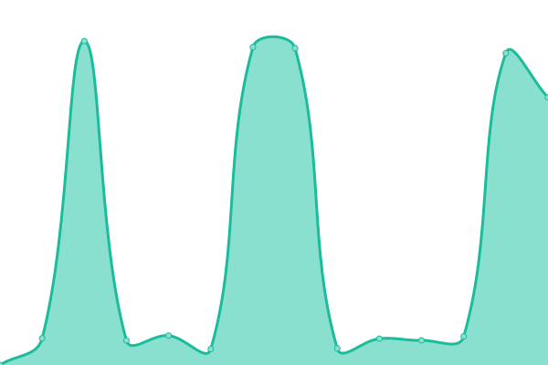
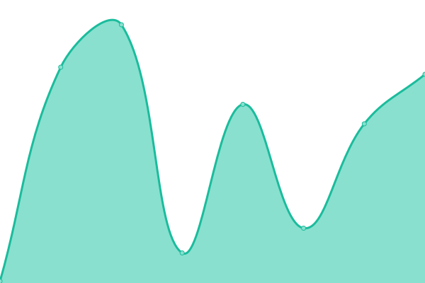
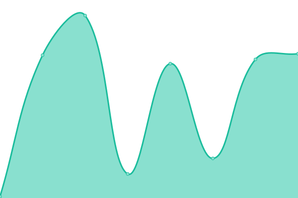

#  Upptime

This repository contains the open-source uptime monitor and status page | powered by [Upptime](https://github.com/upptime/upptime).

you can get your own unlimited and free uptime monitor and status page, powered entirely by a GitHub repository. We use [Issues](https://github.com/hst1189/upptime/issues) as incident reports, [Actions](https://github.com/hst1189/upptime/actions) as uptime monitors, and [Pages](https://hst1189.github.io/upptime) for the status page.

## [📈 Live Status]: <!--live status--> **🟧 部分宕机**

<!--start: status pages-->
<!-- This summary is generated by Upptime (https://github.com/upptime/upptime) -->
<!-- Do not edit this manually, your changes will be overwritten -->
<!-- prettier-ignore -->
| 网站 | 状态 | 记录 | 响应时间 | 正常运行率 |
| --- | ------ | ------- | ------------- | ------ |
|  [www.grapehut.us.kg](https://www.grapehut.us.kg/) | 🟩 正常 | [www-grapehut-us-kg.yml](https://github.com/hst1189/upptime/commits/HEAD/history/www-grapehut-us-kg.yml) | 

 2023ms
     
 | 

<a href="https://hst1189.github.io/upptime/history/www-grapehut-us-kg">100.00%</a>
    

|  [www.grapehut.us.kg/gmerss](https://www.grapehut.us.kg/gmerss/) | 🟩 正常 | [www-grapehut-us-kg-gmerss.yml](https://github.com/hst1189/upptime/commits/HEAD/history/www-grapehut-us-kg-gmerss.yml) | 

 85ms
     
 | 

<a href="https://hst1189.github.io/upptime/history/www-grapehut-us-kg-gmerss">100.00%</a>
    

|  [www.grapehut.us.kg/webstack](https://www.grapehut.us.kg/webstack/) | 🟩 正常 | [www-grapehut-us-kg-webstack.yml](https://github.com/hst1189/upptime/commits/HEAD/history/www-grapehut-us-kg-webstack.yml) | 

 90ms
     
 | 

<a href="https://hst1189.github.io/upptime/history/www-grapehut-us-kg-webstack">100.00%</a>
    

|  [www.grapehut.us.kg/live2d-widget](https://www.grapehut.us.kg/live2d-widget/) | 🟩 正常 | [www-grapehut-us-kg-live2d-widget.yml](https://github.com/hst1189/upptime/commits/HEAD/history/www-grapehut-us-kg-live2d-widget.yml) | 

 78ms
     
 | 

<a href="https://hst1189.github.io/upptime/history/www-grapehut-us-kg-live2d-widget">100.00%</a>
    

|  [miraitech-chiyoda.com](https://miraitech-chiyoda.com/) | 🟥 宕机 | [miraitech-chiyoda-com.yml](https://github.com/hst1189/upptime/commits/HEAD/history/miraitech-chiyoda-com.yml) | 

 0ms
     
 | 

<a href="https://hst1189.github.io/upptime/history/miraitech-chiyoda-com">0.00%</a>
    

<!--end: status pages-->

[**Visit our status website →**](https://hst1189.github.io/upptime)

## 📄 Setting

[参考设定](setting.md)

## 📄 License

- Powered by: [Upptime](https://github.com/upptime/upptime)
- Code: [MIT](./LICENSE) © [Anand Chowdhary](https://anandchowdhary.com), supported by [Pabio](https://pabio.com)
- Data in the `./history` directory: [Open Database License](https://opendatacommons.org/licenses/odbl/1-0/)
